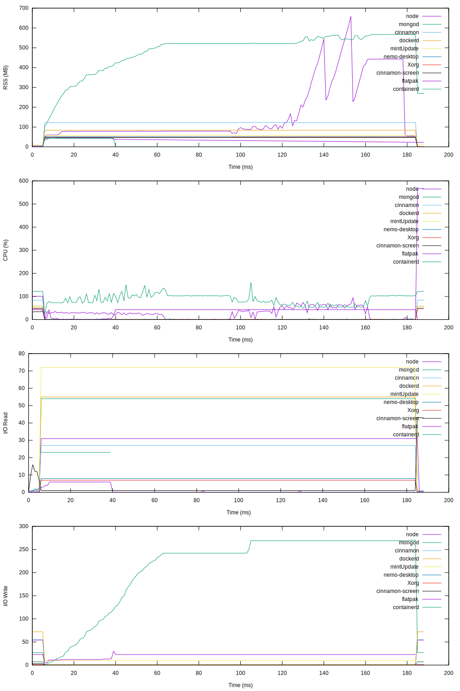
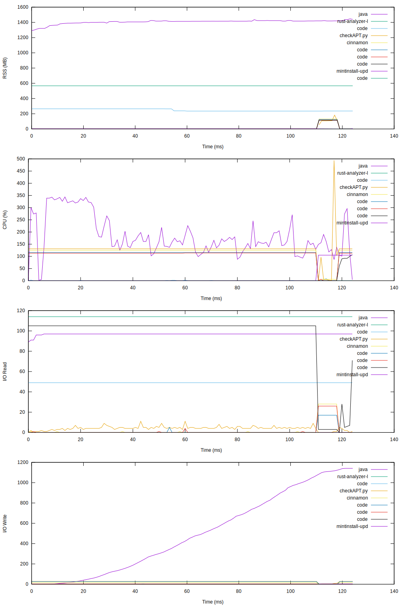

Measure selected processes memory usage
=======================================

For benchmarking experiments I needed a tool that would measure memory usage of specific processes
for a period of test run. This could be done in many ways, for example as part of test framework
or by using some shell scripts, but I chose to
write a small Rust app. The reason was to have universal solution
not baked into testing framework, small memory footprint, flexible to satisfy any
future needs and obviously to play with Rust.

Usage:

```bash
$ agent
```

Stores processes memory usage in memory and on SIGINT writes log of top 10 processes to stdout.

For example:

```bash
$ agent > log.dat
$ ./benchmark-rabbit
benchmark done
$ pkill -2 agent
$ cat agent.log
"ts" "benchmark-rabbit" "beam.smp" "beam.smp" "p4" "p5" "p6" "p7" "p8" "p9" "p10"
27 551 538 398 263 164 164 159 150 146 139
1050 551 538 398 262 164 164 159 150 146 139
```

Turn agent output into gnuplot diagram:

```bash
$ agent > log.dat
$ <EOF > diag.gnuplot
set datafile missing "-"
set term png size 1024,768
set style data linespoints

set key outside
plot for [col=2:*] 'log.dat' using 0:col with lines title columnheader
EOF
$ gnuplot < diag.gnuplot > diagram.png
```

Sample diagram




